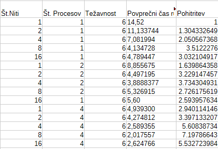

# Bkeep blockchain
### a c++ implementation

### Requirements

- Openssl crypto
- OpenMpi
- OpenMp
- libcurl
- nlohmann_json

## installation
```bash 
## Requirements
sudo apt-get install libssl-dev 
sudo apt-get install openmpi-bin openmpi-doc libopenmpi-dev
sudo apt install libomp-dev 
sudo apt-get install libcurl4-openssl-dev 
sudo apt-get install nlohmann-json3-dev

```
## example usage
```bash
mpirun -np 4 cmake-build-release/blockhain -username blockchain -password blockchain -nfesLimit https://pi.darkosever.si -t 8 -interval 5 -expected 5

```
# Predstavitev

## Tabela pohitritev
